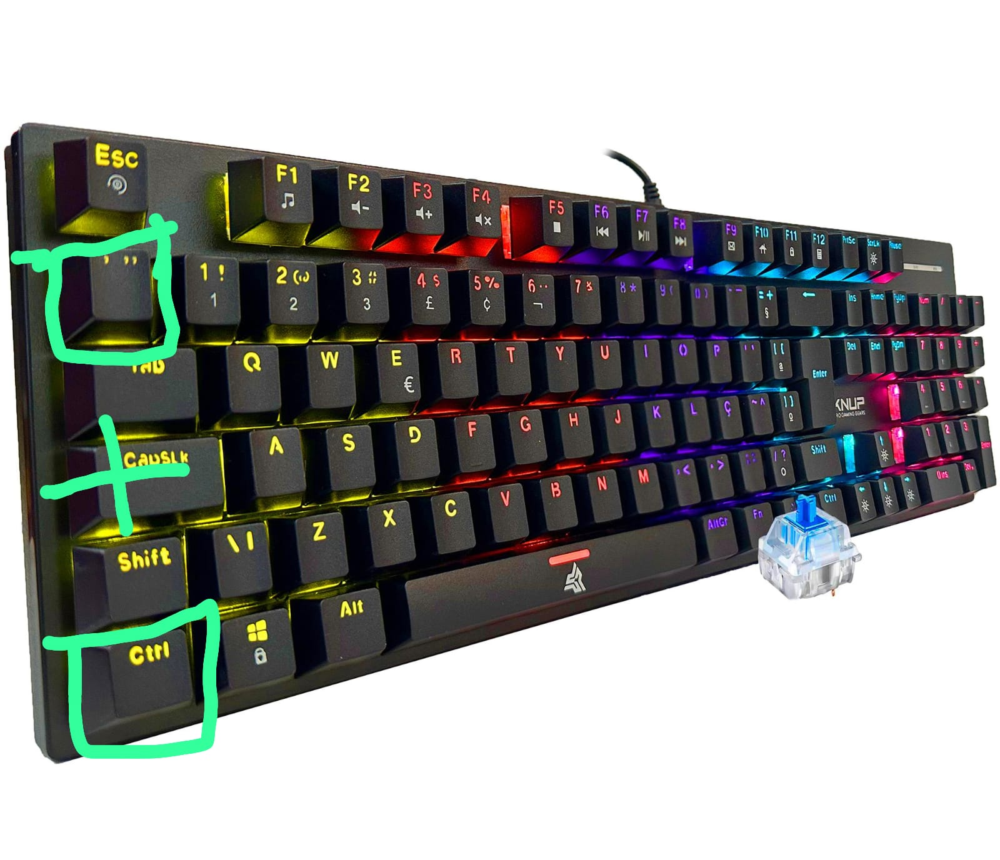
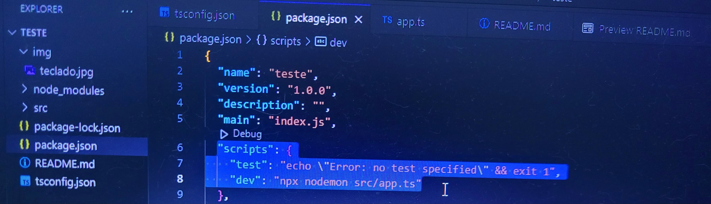
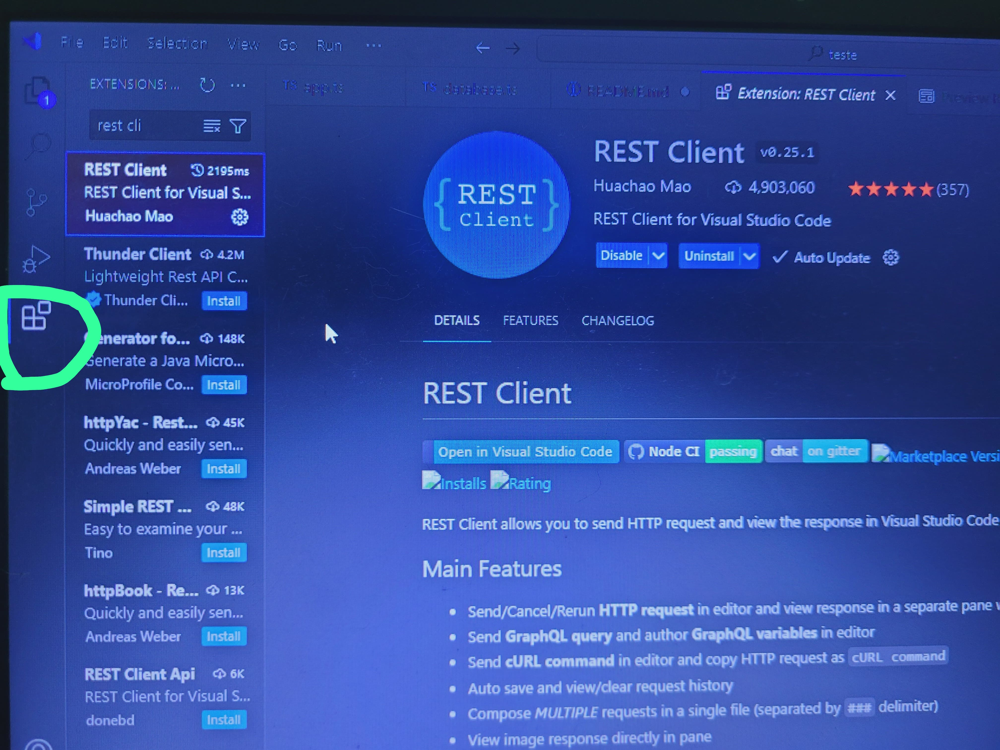

e aí tudo bem? 

 imagino que para você isso tudo deve ser meio novo, mas não se preocupe... vou lhe auxiliar da melhor forma possível 

## **Fase 1**

- crie uma pasta na área de trabalho com o nome que desejar. feito?

- Abra o Vscode, no canto superior esquerdo de sua tela terá algumas opções... clique no "file" e procure a 
opção "Open folder" e va na areá de trabalho e selecione a pasta que você criou

- Segurando as teclas "Ctrl" + a tecla de aspas ", você abrirá o terminal.



- abriu? se sim digite esses seguintes comandos, lembre-se, copie e cole ou digite... você escolhe, mas faça um de cada vez nessa sequência:
	> npm init -y

	> npm install express cors sqlite3 sqlite

	> npm install --save-dev typescript nodemon ts-node @types/express @types/cors

	> npx tsc --init

	> mkdir src

- Após esse importante passo, vai aparecer um arquivo ao lado esquerdo de sua tela... seu nome é tsconfig.json, após achar o arquivo... clique nele e aperte com o mouse em alguma letra e segure as teclas "Ctrl" + "A" e apague tudo. feito?

 ## Ajustando o 'tsconfig.json'

- Copie esse código usando as teclas Ctrl + c e cole no tsconfig.json usando as teclas Ctrl + v : 

```json
{
  "compilerOptions": {
    "target": "ES2017",
    "module": "commonjs",
    "outDir": "./dist",
    "rootDir": "./src",
    "strict": true,
    "esModuleInterop": true,
    "skipLibCheck": true,
    "forceConsistentCasingInFileNames": true
  }
}
```
## Ajustando o package.json

- Em seguida, vá no arquivo package.json que também fica ao lado esquerdo... procure uma linha que esteja escrito: scripts.




Achando ela, sublima ela até a ultima chave antes da vírgula, e cole:

			
      
            "scripts": {
                "test": "echo \"Error: no test specified\" && exit 1",
                "dev": "npx nodemon src/app.ts"
      
      

- até aí tudo bem? se sim, olhe para o canto superior esquerdo de sua tela, você verá uma pasta com o nome "src", clique nela

- Após apertar nela, clique no ícone de um arquivo que tem um "+", se colocar o mouse nele estará escrito "New file",CLIQUE, deu certo? coloque esse nome nele: app.ts

- clique no app.ts que você acabou de criar e coloque esse script: 

```typescript

	import express from 'express';
	import cors from 'cors';

	const port = 3333;
	const app = express();

	app.use(cors());
	app.use(express.json());

	app.get('/', (req, res) => {
        res.send('Hello World');
	});

	app.listen(port, () => {
 	console.log(`Server running on port ${port}`);
	});

```
## "Ligando o seu servidor"
- Fez isso? Aperte novamente as teclas: "Ctrl" + a tecla de aspas ", faça isso porque vai precisar abrir o terminal , abriu o terminal? eu espero que sim, digite no terminal isso: 
					
					- npm run dev

- após o carregamento do terminal vai aparecer uma mensagem nele tipo... Server running on port 3333

- estamos quase finalizando a fase um desse projeto, calma! abra uma nova guia no seu navegador, que pode ser o Chrome ou outro... e coloque isso
na url da guia:


		- http://localhost:3333

- se tudo ocorrer bem, vaí aparecer um "hello world" na sua tela no canto esquerdo, até colocaria uma imagem, mas confio em você, vai saber quando ver...

- Depois de ver esse "hello world", vá até o terminal com `Ctrl + "` e dê um `Ctrl + c` e aperte "S" , em seguida aperte enter para confirmar

## Fase 2

## Ajustanto o Banco de dados

- Na pasta "src" crie mais um arquivo, chame ele dê:

		database.ts

- Adcione esse script no database.ts:

```typescript
import { open } from 'sqlite';
import sqlite3 from 'sqlite3';

let instance: any | null = null;

export async function connect() {
  if (instance) return instance;

  const db = await open({
     filename: './src/database.sqlite',
     driver: sqlite3.Database
   });
  
  await db.exec(`
    CREATE TABLE IF NOT EXISTS users (
      id INTEGER PRIMARY KEY AUTOINCREMENT,
      name TEXT,
      email TEXT
    )
  `);

  instance = db;
  return db;
}
```
## Irterligando o Banco de dados ao Servidor

- Se as outras etapas funcionaram, vou complicar sua vida um pouco infelizmente !

Vá no arquivo "app.ts" que está na pasta "src" que você criou, apague tudo que houver dentro dele e coloque esse script:

```typescript
import express from 'express';
import cors from 'cors';
import { connect } from './database';

const port = 1111;
const app = express();

app.use(cors());
app.use(express.json());
app.use(express.static(__dirname + '/../public'))

app.get('/', (req, res) => {
  res.send('Hello World');
});

app.post('/users', async (req, res) => {
    const db = await connect();
    const { name, email } = req.body;

    const result = await db.run('INSERT INTO users (name, email) VALUES (?, ?)', [name, email]);
    const user = await db.get('SELECT * FROM users WHERE id = ?', [result.lastID]);

    res.json(user);
});


app.listen(port, () => {
  console.log(`Server running on port ${port}`);
});

app.get('/users', async (req, res) => {
    const db = await connect();
    const users = await db.all('SELECT * FROM users');
  
    res.json(users);
});

app.put('/users/:id', async (req, res) => {
  const db = await connect();
  const { name, email } = req.body;
  const { id } = req.params;

  await db.run('UPDATE users SET name = ?, email = ? WHERE id = ?', [name, email, id]);
  const user = await db.get('SELECT * FROM users WHERE id = ?', [id]);

  res.json(user);
});

app.delete('/users/:id', async (req, res) => {
  const db = await connect();
  const { id } = req.params;

  await db.run('DELETE FROM users WHERE id = ?', [id]);

  res.json({ message: 'User deleted' });
});
```

## Baixando extensões

- No lado esquerdo da sua tela há um ícone de um quadrado formado por 4 querdrados menores, um desses quadrados está se separando dos outros, aperte nesse ícone!

- baixe essa extensão: 



- Para installar basta apertar "install"

## inserindo dados no servidor/ teste 

- Crie um arquivo fora de todas as pastas, menos a pasta principal que você criou na área de trabalho, esse arquivo vai se chamar:

      teste.http

- Lembre-se, para criar um arquivo basta dar um clique no ícone de arquivo que tem aquele "+"!

- Coloque esse script dentro do teste.http:

```python
POST http://localhost:1111/users HTTP/1.1
content-type: application/json

{
  "name": "John Doe",
  "email": "johndoe@mail.com"
}

####

PUT http://localhost:1111/users/1 HTTP/1.1
content-type: application/json

{
  "name": "John Doe Updated",
  "email": "johndoe@mail.com"
}

####

DELETE http://localhost:1111/users/1 HTTP/1.1'
```

- Fazendo isso você está dizendo para o servidor adicionar um cara no seu banco de dados, aí ele fala o nome John doe e o email desse cara
- o Post é um método para adcionar pessoas no seu servidor, Put é para editar e Delete... bem, acredito que não preciso dizer kkkk

- Antes de testar isso "mate" seu servidor com `Ctrl + c`, inicialize o servidor novamente com esse comando:

      npm run dev

- Para saber se está funcionando a inserção, edição e o apagar, aperte nas palavras que vai aparecer acima de POST, PUT E DELETE,  colocando o mouse acima deles vai aparecer uma pequena mensagem "Send request", clique nela, na sêquencia POST, aí vá no link e olhe lá no navegador, depois PUT... olhe novamente e por fim o DELETE.

- Para observar se funcionou vá no seu navegador e coloque na url esse link:

            http://localhost:1111/users


- Daí vai aparecer o nome, id e email do "cliente", Quando for apertar o "send request", comece pelo 'POST', cheque nesse link aí, e teste o 'PUT' e por final o 'DELETE'


- Após apertar o send requeste acima do 'PUT' observe nesse link com final barra users, acesse ele e procure o cliente com id = 1, se o nome dele mudou de Jhon doe para Jhon update, funcionou, e se fizer isso no 'DELETE', e voltar nessa guia do users e o cliente 1 tiver sido apagado... funcionou

## Criando o `Html` e integrando ele com o Banco de dados

- Crie uma pasta chamada public dentro da pasta principal do seu projeto, aquela que você criou lá no começo na área de trabalho

- Lembrando que você pode fazer isso pelo Vscode, apenas direcione o mouse até os arquivos no canto superior esquerdo de sua tela e vai aparecer um ícone de uma pasta com um símbolo de `+´, aperte nele e nomeie a sua pasta com o nome de:

      public

  
## Adicinando o script no public

aperte no public e clique no ícone de arquivo com ´+´ , nomeie esse arquivo dentro do public de:

          index.html


- Dentro do arquivo `index.html´, cole esse script:

```html

<!DOCTYPE html>
<html lang="en">
<head>
  <meta charset="UTF-8">
  <meta name="viewport" content="width=device-width, initial-scale=1.0">
  <title>Document</title>
</head>

<body>
  <form>
    <input type="text" required name="name" placeholder="Nome">
    <input type="email" required name="email" placeholder="Email">
    <button type="submit">Cadastrar</button>
  </form>
  <table>
    <thead>
      <tr>
        <th>Id</th>
        <th>Name</th>
        <th>Email</th>
        <th>Ações</th>
      </tr>
    </thead>
    <tbody>
      <!--  -->
    </tbody>
  </table>
  <script>
    const form = document.querySelector('form')
    form.addEventListener('submit', async (event) => {
      event.preventDefault()
      const name = form.name.value
      const email = form.email.value
      await fetch('/users', {
        method: 'POST',
        headers: { 'Content-Type': 'application/json' },
        body: JSON.stringify({ name, email })
      })
      form.reset()
      fetchData()
    })
    const tbody = document.querySelector('tbody')
    async function fetchData() {
      const resp = await fetch('/users')
      const data = await resp.json()
      tbody.innerHTML = ''
      data.forEach(user => {
        const tr = document.createElement('tr')
        tr.innerHTML = `
          <td>${user.id}</td>
          <td>${user.name}</td>
          <td>${user.email}</td>
          <td>
            <button class="excluir">excluir</button>
            <button class="editar">editar</button>
          </td>
        `
        const btExcluir = tr.querySelector('button.excluir')
        const btEditar = tr.querySelector('button.editar')
        btExcluir.addEventListener('click', async () => {
          await fetch(`/users/${user.id}`, { method: 'DELETE' })
          tr.remove()
        })
        btEditar.addEventListener('click', async () => {
          const name = prompt('Novo nome:', user.name)
          const email = prompt('Novo email:', user.email)
          await fetch(`/users/${user.id}`, {
            method: 'PUT',
            headers: { 'Content-Type': 'application/json' },
            body: JSON.stringify({ name, email })
          })
          fetchData()
        })
        tbody.appendChild(tr)
      })
    }
    fetchData()
  </script>
</body>
</html>
```

## Finalmente familia

- acesse essa url:` http://localhost:1111/` e teste o adicionar clientes, editar e deletar... fim e parabéns 